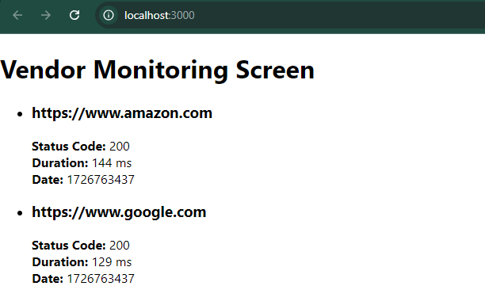

# Vendor Status Checker

This project is a simple web server that periodically checks the status of certain vendors.
This solution was was my implementation for a take-home exercise, with the aim of implementing the best possible solution within an allotted time frame of approx. 2 hours.

## Table of Contents

- [Features](#features)
- [Project Structure](#project-structure)
- [Requirements](#requirements)
- [Getting Started](#getting-started)
  - [Setting Up the Flask API](#setting-up-the-flask-api)
  - [Setting Up the React UI](#setting-up-the-react-ui)
- [Usage](#usage)
- [API Endpoints](#api-endpoints)
- [Sample API Response](#sample-api-response)
- [Sample Output](#sample-output)

## Features

- A Python Flask API that fetches the status of the **Google** and **Amazon** homepages every minute.
- React-based frontend that automatically fetches the API every 60 seconds to update the UI with status information.
- Cross-Origin Resource Sharing (CORS) enabled to allow communication between the React frontend and Flask backend.

## Project Structure

```bash
.
├── backend/
│   ├── venv/
│   └── app.py
├── ui/vendor-monitoring-ui/
│   ├── node_modules/
│   ├── public/
│   ├── src/
│       ├── App.js
│       └── index.js
│   └── package.json
├── .gitignore
├── requirements.txt
└── README.md
```

## Requirements
- **Python 3.8+**
- **Flask**
- **Node.js and npm**

## Getting Started

### Setting Up the Flask API

1. **Clone the repository**:
    ```bash
    git clone https://github.com/jackjduggan/vendor-monitoring-webserver.git
    cd vendor-monitoring-webserver/
    ```

2. **Create a virtual environment, and install dependencies**:
    ```bash
    python3 -m venv venv
    source venv/bin/activate  # Linux/macOS
    venv\Scripts\activate     # Windows

    pip install -r requirements.txt
    ```

3. **Run the Flask Server**
    ```bash
    python3 backend/app.py
    ```

    You should get a message like ` * Running on http://127.0.0.1:5000`

   If everything is working correctly, you should get an output like below when testing the API in a tool like **Postman**, or in the terminal with `curl`.
   
   

## Setting up the React UI

1. **Navigate to the frontend directory**
    ```bash
    cd vendor-monitoring-webserver/ui/vendor-monitoring-ui/
    ```

2. **Install dependencies**
    ```bash
    npm install
    ```

3. **Run the React app**
    ```bash
    npm start
    ```

## Usage

Once both the Flask API and the React UI are up and running:
- Visit `http://localhost:3000` to view the status checker UI.
- The UI should automatically refresh every minute, displaying the status of **Google** and **Amazon**. You should see the *time* value change every 60 seconds.

## API Endpoints

- **GET /v1/google-status:** Returns the status of Google.
- **GET /v1/amazon-status:** Returns the status of Amazon.
- **GET /v1/all-status:** Returns the status of both Google and Amazon in a single response.

## Sample API Response

```json
[
  {
    "url": "https://www.google.com",
    "statusCode": 200,
    "duration": 150,
    "date": 1606636800
  },
  {
    "url": "https://www.amazon.com",
    "statusCode": 503,
    "duration": 273,
    "date": 1606636803
  }
]
```

## Sample Output


